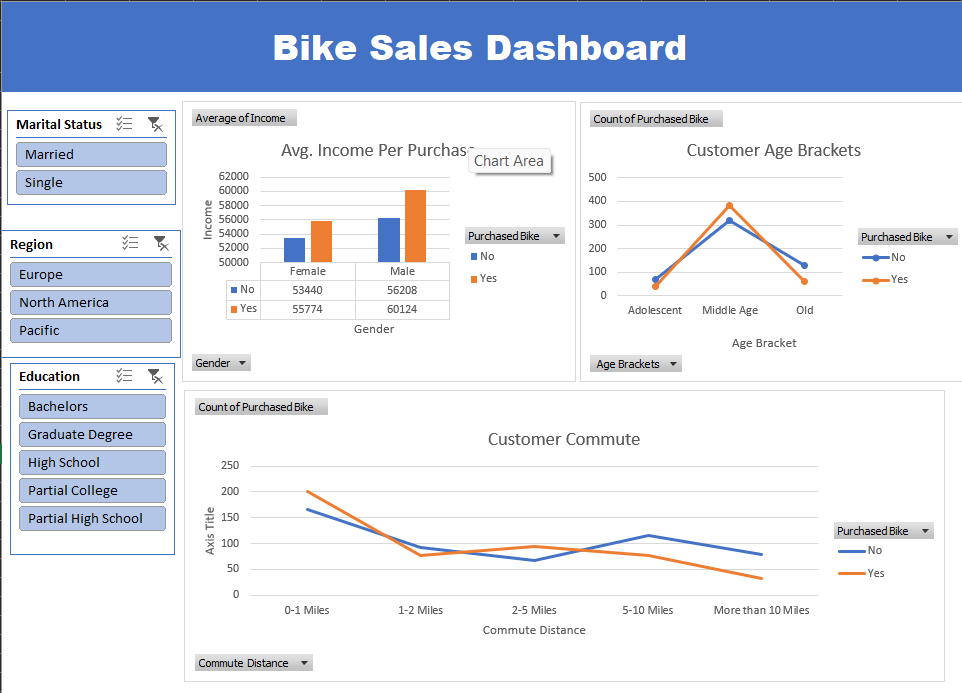

# 📊 Excel Bike Sales Dashboard

This project involves analyzing and visualizing bike sales data using Microsoft Excel.

## 🔧 Tools & Techniques
- Excel formulas: `VLOOKUP`, `IF`, `TEXT`, `DATE`, etc.
- Pivot Tables, Slicers, and Conditional Formatting
- Interactive charts and dashboard creation

## 📈 Key Features
- Cleaned and transformed raw bike sales data
- Visualized key metrics like revenue, profit, and regional performance
- Built an interactive dashboard for clear insights

## 🔗 View Interactive Dashboard
[Click here to view the datset and the dashboard in Google Sheets](https://docs.google.com/spreadsheets/d/1NrPJDtszBqP05_XdocVf1VkHBHa66JC-SHY2IjDDP5Y/view?usp=sharing)

## 📁 File Included
- `Excel Portfolio Project.xlsx`: Contains the full project with raw data, analysis, and dashboard
